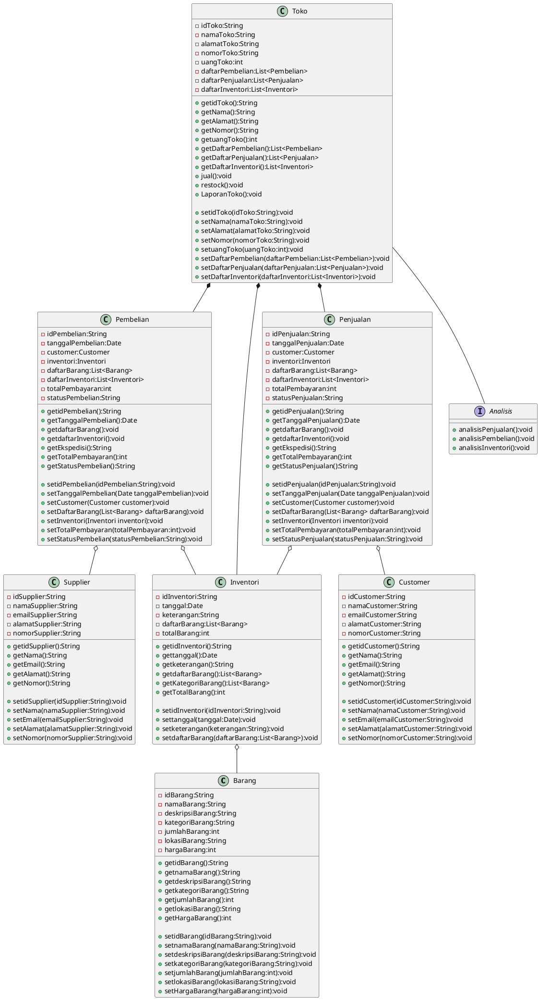

# PBO2023-2KS4-Kelompok 2-Aplikasi Management Inventory

```kelompok
Kelompok 2 :

1. Archangela Renata Patricia (222111914)
2. Muhammad Zabbar Falihin (222112225)
3. Raihan Rahmanda Junianto (222112303)
4. Rio Manuppak Siahaan(222112324)
5. Shabrina  Alfira Nisa(222112359)
6. Shela Alfiyani Amalia(222112365)
7. Sonya Ananta Panjaitan(222112377)
8. Umar Hadi Pranoto(222112404)
```

## Kasus 3: Aplikasi Manajemen Inventori

Aplikasi manajemen inventori adalah sebuah sistem yang dirancang untuk membantu bisnis dalam melacak, mengelola, dan mengoptimalkan stok atau persediaan barang mereka. Proses bisnis aplikasi manajemen inventori meliputi beberapa tahapan seperti berikut:

1. Pengumpulan Data Inventori: Tahap awal dari proses bisnis aplikasi manajemen inventori adalah pengumpulan data inventori. Hal ini meliputi pengumpulan informasi tentang semua barang yang dimiliki oleh bisnis, mulai dari nama barang, deskripsi, jumlah, hingga lokasi penyimpanan barang tersebut.

2. Pembaruan Data Inventori: Setelah data inventori dikumpulkan, selanjutnya adalah pembaruan data inventori secara berkala. Hal ini dilakukan untuk memastikan data inventori selalu up-to-date dan akurat. Pengguna aplikasi manajemen inventori juga dapat mengubah data inventori seperti menambah atau mengurangi jumlah barang yang tersedia.

3. Pencatatan Transaksi Inventori: Setiap transaksi yang terjadi pada barang harus dicatat secara akurat pada aplikasi manajemen inventori. Transaksi tersebut meliputi pembelian barang, penjualan barang, atau transfer barang dari satu lokasi ke lokasi lain.

4. Analisis Data Inventori: Aplikasi manajemen inventori juga dapat membantu bisnis dalam menganalisis data inventori mereka. Analisis data inventori ini bisa memberikan wawasan tentang permintaan pelanggan, kecepatan rotasi barang, serta produk apa yang paling populer di pasaran.

5. Pengoptimalan Stok: Setelah data inventori dianalisis, pengguna aplikasi manajemen inventori dapat mengoptimalkan stok barang mereka. Hal ini dilakukan dengan cara menyesuaikan jumlah barang yang tersedia sesuai dengan permintaan pasar, dan memastikan stok barang selalu tersedia pada waktu yang tepat.

6. Pelaporan: Aplikasi manajemen inventori juga dapat menghasilkan laporan tentang stok barang yang dimiliki bisnis. Laporan ini dapat memberikan informasi tentang kinerja inventori bisnis, termasuk laporan keuangan seperti laba rugi dan neraca.

Dengan menggunakan aplikasi manajemen inventori, bisnis dapat meningkatkan efisiensi operasional dan meningkatkan profitabilitas. Dalam proses bisnis aplikasi manajemen inventori, pengguna aplikasi harus memastikan data inventori selalu terjaga keakuratannya dan selalu diperbarui secara berkala.

## Class Diagram



### Alur Class Diagram

`class Toko` bertindak sebagai main class yang mengatur seluruh class yang ada. `class Toko` dapat melakukan Pembelian, Penjualan, dan mengubah inventori. `class Toko` juga dapat melakukan analisis terhadap Pembelian, Penjualan, dan Inventori.

`class Pembelian` bertindak sebagai supplier yang melakukan pembelian barang ke `class Toko`.

`class Penjualan` bertindak sebagai customer yang melakukan penjualan barang dari `class Toko`.

`class Inventori` bertindak sebagai inventori yang berisi barang-barang yang ada di `class Toko`. `class Inventori` juga bertugas sebagai "notulensi" yang mencatat seluruh transaksi yang terjadi di `class Toko`: Pembelian, Penjualan, maupun editing `class Barang` yang tercatat pada `class Inventori` itu sendiri.

### Penjelasan lengkap class diagram

`class Toko` berisi informasi yang berhubungan dengan toko, seperti nama toko, alamat toko, nomor telepon toko, daftar pembelian, daftar penjualan, dan daftar inventori.

Penjelasan fungsi-fungsi:

* `getidToko()` : mengambil id toko
* `getNama()` : mengambil nama toko
* `getAlamat()` : mengambil alamat toko
* `getNomor()` : mengambil nomor telepon toko
* `getuangToko()` : mengambil total uang toko
* `getDaftarPembelian()` : mengambil daftar pembelian
* `getDaftarPenjualan()` : mengambil daftar penjualan
* `getDaftarInventori()` : mengambil daftar inventori
* `jual()` : melakukan penjualan
* `restock()` : melakukan restock
* `LaporanToko()` : melihat laporan toko
* `setidToko(idToko:String)` : mengubah id toko
* `setNama(namaToko:String)` : mengubah nama toko
* `setAlamat(alamatToko:String)` : mengubah alamat toko
* `setNomor(nomorToko:String)` : mengubah nomor telepon toko
* `setuangToko(uangToko:int)` : mengubah total uang toko
* `setDaftarPembelian(daftarPembelian:List<Pembelian>)` : mengubah daftar pembelian
* `setDaftarPenjualan(daftarPenjualan:List<Penjualan>)` : mengubah daftar penjualan
* `setDaftarInventori(daftarInventori:List<Inventori>)` : mengubah daftar inventori

`class Pembelian` berisi informasi yang berhubungan dengan pembelian, seperti id pembelian, tanggal pembelian, daftar barang, daftar inventori, total pembayaran, dan status pembelian.

Penjelasan fungsi-fungsi:

* `getidPembelian()` : mengambil id pembelian
* `getTanggalPembelian()` : mengambil tanggal pembelian
* `getdaftarBarang()` : mengambil daftar barang
* `getdaftarInventori()` : mengambil daftar inventori
* `getEkspedisi()` : mengambil ekspedisi
* `getTotalPembayaran()` : mengambil total pembayaran
* `getStatusPembelian()` : mengambil status pembelian
* `setidPembelian(idPembelian:String)` : mengubah id pembelian
* `setTanggalPembelian(Date tanggalPembelian)` : mengubah tanggal pembelian
* `setdaftarBarang(List<Barang> daftarBarang)` : mengubah daftar barang
* `setdaftarInventori(Inventori inventori)` : mengubah daftar inventori
* `setEkspedisi(Ekspedisi ekspedisi)` : mengubah ekspedisi
* `setTotalPembayaran(int totalPembayaran)` : mengubah total pembayaran
* `setStatusPembelian(String statusPembelian)` : mengubah status pembelian

`class Penjualan` berisi informasi yang berhubungan dengan penjualan, seperti id penjualan, tanggal penjualan, daftar barang, daftar inventori, total pembayaran, dan status penjualan.

Penjelasan fungsi-fungsi:

* `getidPenjualan()` : mengambil id penjualan
* `getTanggalPenjualan()` : mengambil tanggal penjualan
* `getdaftarBarang()` : mengambil daftar barang
* `getdaftarInventori()` : mengambil daftar inventori
* `getEkspedisi()` : mengambil ekspedisi
* `getTotalPembayaran()` : mengambil total pembayaran
* `getStatusPenjualan()` : mengambil status penjualan
* `setidPenjualan(idPenjualan:String)` : mengubah id penjualan
* `setTanggalPenjualan(Date tanggalPenjualan)` : mengubah tanggal penjualan
* `setdaftarBarang(List<Barang> daftarBarang)` : mengubah daftar barang
* `setdaftarInventori(Inventori inventori)` : mengubah daftar inventori
* `setEkspedisi(Ekspedisi ekspedisi)` : mengubah ekspedisi
* `setTotalPembayaran(int totalPembayaran)` : mengubah total pembayaran
* `setStatusPenjualan(String statusPenjualan)` : mengubah status penjualan

`class Supplier` berisi informasi yang berhubungan dengan supplier, seperti id supplier, nama supplier, email supplier, alamat supplier, dan nomor supplier. Terdapat 5 method, yaitu method untuk mengambil informasi dari class Supplier, method untuk mengubah informasi dari class Supplier, method untuk mengambil id supplier, method untuk mengambil nama supplier, dan method untuk mengambil nomor supplier.

Penjelasan fungsi-fungsi:

* `getidSupplier()` : mengambil id supplier
* `getNama()` : mengambil nama supplier
* `getAlamat()` : mengambil alamat supplier
* `getNomor()` : mengambil nomor supplier
* `getEmail()` : mengambil email supplier
* `setidSupplier(idSupplier:String)` : mengubah id supplier
* `setNama(namaSupplier:String)` : mengubah nama supplier
* `setAlamat(alamatSupplier:String)` : mengubah alamat supplier
* `setNomor(nomorSupplier:String)` : mengubah nomor supplier
* `setEmail(emailSupplier:String)` : mengubah email supplier

`class Customer` berisi informasi yang berhubungan dengan customer, seperti id customer, nama customer, email customer, alamat customer, dan nomor customer.

Penjelasan fungsi-fungsi:

* `getidCustomer()` : mengambil id customer
* `getNama()` : mengambil nama customer
* `getAlamat()` : mengambil alamat customer
* `getNomor()` : mengambil nomor customer
* `getEmail()` : mengambil email customer
* `setidCustomer(idCustomer:String)` : mengubah id customer
* `setNama(namaCustomer:String)` : mengubah nama customer
* `setAlamat(alamatCustomer:String)` : mengubah alamat customer
* `setNomor(nomorCustomer:String)` : mengubah nomor customer
* `setEmail(emailCustomer:String)` : mengubah email customer

`class Inventori` berisi informasi yang berhubungan dengan inventori, seperti id inventori, tanggal, keterangan, daftar barang, dan total barang. Terdapat 6 method, yaitu method untuk mengambil informasi dari class Inventori, method untuk mengubah informasi dari class Inventori, method untuk mengambil daftar barang, method untuk mengambil kategori barang, dan method untuk mengambil total barang.

Penjelasan fungsi-fungsi:

* `getidInventori()` : mengambil id inventori
* `getTanggal()` : mengambil tanggal
* `getKeterangan()` : mengambil keterangan
* `getdaftarBarang()` : mengambil daftar barang
* `getTotalBarang()` : mengambil total barang
* `setidInventori(idInventori:String)` : mengubah id inventori
* `setTanggal(tanggal:Date)` : mengubah tanggal
* `setKeterangan(keterangan:String)` : mengubah keterangan
* `setdaftarBarang(daftarBarang:List<Barang>)` : mengubah daftar barang
* `setTotalBarang(totalBarang:int)` : mengubah total barang

`class Barang` berisi informasi yang berhubungan dengan barang, seperti id barang, nama barang, deskripsi barang, kategori barang, jumlah barang, lokasi barang, dan harga barang. Terdapat 8 method, yaitu method untuk mengambil informasi dari class Barang, method untuk mengubah informasi dari class Barang, method untuk mengambil id barang, method untuk mengambil nama barang, method untuk mengambil deskripsi barang, method untuk mengambil kategori barang, method untuk mengambil jumlah barang, dan method untuk mengambil harga barang.

Penjelasan fungsi-fungsi:

* `getidBarang()` : mengambil id barang
* `getNama()` : mengambil nama barang
* `getDeskripsi()` : mengambil deskripsi barang
* `getKategori()` : mengambil kategori barang
* `getJumlah()` : mengambil jumlah barang
* `getLokasi()` : mengambil lokasi barang
* `getHarga()` : mengambil harga barang
* `setidBarang(idBarang:String)` : mengubah id barang
* `setNama(namaBarang:String)` : mengubah nama barang
* `setDeskripsi(deskripsiBarang:String)` : mengubah deskripsi barang
* `setKategori(kategoriBarang:String)` : mengubah kategori barang
* `setJumlah(jumlahBarang:int)` : mengubah jumlah barang
* `setLokasi(lokasiBarang:String)` : mengubah lokasi barang
* `setHarga(hargaBarang:int)` : mengubah harga barang

`interface Analisis` berisi method untuk melakukan analisis penjualan, pembelian, dan inventori dimana method mengambil beberapa informasi dari class Inventori, Pembelian, dan Penjualan. Method ini digunakan untuk menyesuaikan jumlah barang yang tersedia sesuai dengan permintaan pasar, dan memastikan stok barang selalu tersedia pada waktu yang tepat.

Penjelasan lengkap fungsi :

* `analisisPembelian()` : melakukan analisis terhadap class Pembelian yang dilakukan melalui method restock barang yang akan dijual. Method ini akan mengambil informasi dari class Pembelian, dan mengubah informasi pada class Inventori. Method ini akan menampilkan informasi terkait pembelian barang yang dilakukan oleh toko.

* `analisisPenjualan()` : melakukan analisis terhadap class Penjualan yang dilakukan melalui method penjualan barang. Method ini menyajikan informasi terkait penjualan barang yang dilakukan oleh toko, seperti permintaan pelanggan dan produk apa yang paling populer serta memberikan rekomendasi stok barang yang harus disiapkan.

* `analisisInventori()` : melakukan analisis terhadap class Inventori yang berisi mengenai event-event apa saja yang terjadi pada Toko. Method ini akan kecepatan rotasi barang.
