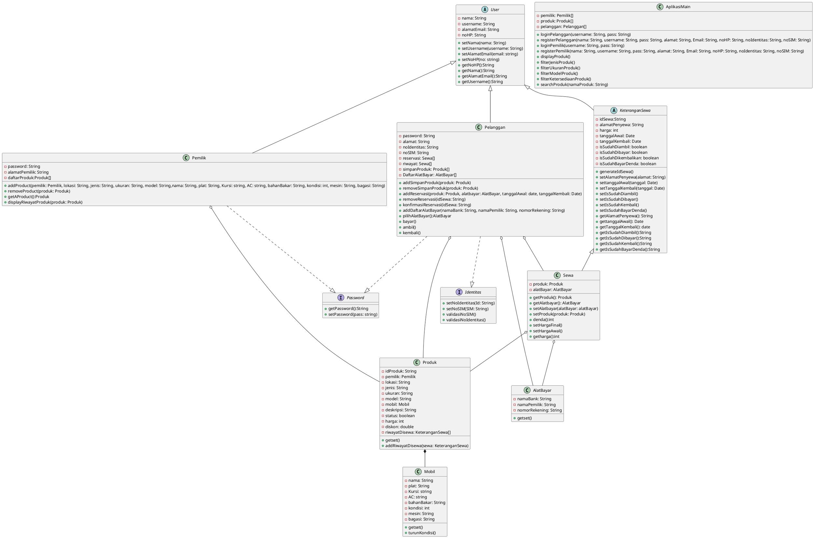

# UML Diagram Program Penyewaan Mobil
---
KELOMPOK 1 
Anggota:  
- Jihan Maisaroh (222112122)
- Khuzaimah Putri (222112137)
- Kuntum Khairani Aselia (222112143)
- M. Khusen Ali Al Anjabi (222112164)
- Nasya Zahira (222112241)
- Oktafianto Asset Perdana (222112280)
- Satrio Putyo Danendra (222112354)
- Yuli Arindah (222112423)
---
<b>A. Deskripsi Kasus</b> 
Bisnis aplikasi penyewaan mobil memerlukan proses yang cermat dan efisien untuk memastikan pelanggan mendapatkan pengalaman yang menyenangkan dalam menyewa mobil. 

Satu orang dapat menyewa lebih dari satu mobil. Apabila durasi penyewaan sudah habis tetapi mobil belum dikembalikan, penyewa tidak bisa menyewa mobil lagi tetapi dapat memperpanjang durasi sewa. 

Durasi sewa dapat menyesuaikan satuan jam, hari, minggu, atau bulan. Kemudian biaya sewa mengikuti waktu sewa dan akan dikenakan <i>charge</i> untuk <i>overtime</i>. 

<i>User</i> hanya berperan sebagai penyewa bukan penyedia mobil untuk disewakan. Untuk sistem pembayaran akan dibuat array baru karena satu <i>user</i> dapat memiliki banyak rekening atau dompet digital. Kemudian kondisi mobil akan berkurang seiring bertambahnya jumlah penyewaan. 

<b>B. UML Diagram</b> 

<b>C. Penjelasan UML Diagram</b> 

Terdapat 6 kelas, 2 abstrak 2 interface, dan 1 kelas main di dalam desain UML Diagram aplikasi penyewaan mobil kelompok kami. 

<b>1. Abstrak Class User</b> 

Abstrak ini merupakan cetak biru untuk membuat kelas pelanggan, petugas, dan sewa. Properti yang dimiliki berupa nama, alamatEmail, noHP, dan username, serta method untuk <i>get</i> dan <i>set</i> seluruh properti tersebut.

<b>2. Class Pelanggan</b> 

Kelas ini adalah cetak biru bagi pembentukan objek pelanggan. Pelanggan adalah orang yang dapat menyewa mobil, dan merupakan instance dari abstrak user yang mengimplementasi interface validasi. Oleh sebab itu, kelas ini memiliki properti:
<ul>
    <li>password: String</li>
    <li>alamat: String</li>
    <li>noIdentitas: String</li>
    <li>noSIM: String</li>
    <li>reservasi: Sewa[] 
        Menyimpan reservasi yang telah dibuat pelanggan akan tetapi belum dibayar. Reservasi yang telah dibayar dan dikonfirmasi akan dihapus dari array ini dan kemudian ditambahkan ke array riwayat
    </li>
    <li>riwayat: Sewa[] 
        Menyimpan reservasi yang telah dibuat dan dikonfirmasi oleh pelanggan
    </li>
        <li>simpanProduk: Produk[] 
        Menyimpan produk yang akan ingin disewa oleh pelanggan tetapi belum dibuat reservasi (seperti wishlist)
    </li>
        </li>
        <li>DaftarAlatBayar: AlatBayar[] 
            Menyimpan alat pembayaran yang dimiliki oleh pelanggan
    </li>
</ul>
	Selain itu, kelas ini memiliki method:
<ul>
    <li>+ addSimpanProduk()</li>
    <li>+ removeSimpanProduk()</li>
    <li>+ addReservasi() 
        Membuat reservasi, membuat objek sewa dan memasukkan ke array reservasi
    </li>
    <li>+ removeReservasi() 
        Menghapus sewa dari array reservasi
    </li>
    <li>+ konfirmasiReservasi() 
	    Memanggil method bayar(), pilihAlatBayar() dan removeReservasi(), serta menambahkan yang diremove tersebut ke riwayat
    </li>
    <li>+ addDaftarAlatBayar() 
        Menambahkan alat bayar pengguna
    </li>
    <li>+ pilihAlatBayar():AlatBayar 
	    Memilih 1 alat bayar yang akan digunakan oleh pengguna untuk objek sewa tertentu
    </li>
    <li>+ bayar() 
	    Membayar produk yang telah direservasi
    </li>
    <li>+ ambil() 
	    Konfirmasi mengambil produk di lokasi
    </li>
    <li>+ kembali() 
	    Konfirmasi mengembalikan produk di lokasi
    </li>
</ul>

<b>3. Abstrak Class Keterangan Sewa</b> 

Abstrak ini merupakan cetak biru untuk membuat kelas sewa. Properti yang dimiliki berupa idSewa,alamatPenyewa, harga, tanggalAwal, tanggalKembali, isSudahDiambil, isSudahDibayar, isSudahDikembalikan, dan isSudahBayarDenda, serta method untuk <i>get</i> dan <i>set</i> seluruh properti tersebut.

<b>4. Class Sewa </b> 

Class sewa adalah cetak biru bagi pembuatan objek sewa yang akan dilakukan pelanggan. Class ini adalah instance dari abstrak user untuk menyimpan data pelanggan yang menyewa.
Properti kelas ini antara lain: 
<ul>
    <li>alamatPenyewa: String</li>
    <li>produk: Produk</li>
    <li>alatBayar: AlatBayar</li>>
</ul> 
    Selain itu, kelas ini memiliki method:
<ul>
    <li>+ setProduk() 
	    Mengatur produk yang akan disewa</li>
    <li>+ setHargaAwal() 
	    Mengatur harga produk yang akan disewa sesuai tanggalAwal dan tanggalKembali</li>
    <li>+ setAlatbayar() 
	    Mengatur pembayaran produk yang akan disewa</li>
    <li>+ denda():int 
	    Mengatur denda sesuai pelanggaran dari termsCondition dan keterlambatan</li>
    <li>+ setHargaFinal() 
	    Menambahkan harga awal dengan denda</li>
</ul>

<b>5. Class Pemilik</b> 

Instance dari abstrak user. Memiliki properti:
<ul>
    <li>password: String</li>
    <li>daftarProduk:Produk[]</li>
</ul>
Kelas ini memiliki kemampuan untuk:
<ul>
    <li>+ addProduct() 
	Menambahkan produk yang dipajang di aplikasi/main</li>
    <li>+ removeProduct() 
	Menghapus produ yang ada di aplkasi/main</li>
    <li>+ getAProduct():Produk</li>
    <li>+ displayRiwayatSewaProduk(produk: Produk) 
	Menampilkan riwayat suatu produk disewa oleh siapa saja</li>
</ul>

<b> 6. Class Mobil </b> 
Berisi ciri-ciri fisik yang ada di mobil.
Memiliki properti:
<ul>
    <li>nama: String</li>
    <li>plat: String</li>
    <li>Kursi: string</li>
    <li>AC: string</li>
    <li>bahanBakar: String</li>
    <li>kondisi: int</li>
    <li>mesin: String</li>
    <li>bagasi: String</li>
</ul>
Serta memiliki method:
<ul>
    <li>+ Getset untuk setiap atribut</li>
    <li>turunkondisi() 
        Setiap penyewaan dilakukan, kondisi akan turun beberapa persen, secara random</li>
</ul>

<b>7. Class Produk </b> 
Memiliki komposisi mobil. Merupakan gabungan dari class mobil dengan properti lain seperti:
<ul>
    <li>idProduk: String</li>
    <li>jenis: String</li>
    <li>ukuran: String</li>
    <li>model: String </li>
    <li>mobil: Mobil</li>
    <li>deskripsi: String</li>
    <li>status: boolean</li>
    <li>harga: int</li>
    <li>diskon: double</li>
    <li>riwayatDisewa: User[]</li>
</ul>

Method yang dimiliki antara lain:
<ul>
    <li>+ get<property>()</li>
    <li>+ set<property>()</li>
    <li>+ addRiwayatDisewa()</li>
</ul>

<b>8. Class AlatBayar </b> 
Cetak biru alat bayar yang dimiliki pelanggan dan digunakan untuk transaksi pembayaran.
Memiliki properti:
<ul>
   <li>namaBank: String</li>
   <li>namaPemilik: String</li>
   <li>nomorRekening: String</li>
</ul>
Dengan method untuk get dan set properti tersebut.
 
 
<b>8. Interface Validasi</b> 
Untuk validasi nomor identitas dan nomor SIM pelanggan. Diimplementasikan oleh kelas pelanggan
 
 
<b>9. Class AplikasiMain </b> 
Menyimpan:
<ul>
<li>array produk </li> 
<li>pelanggan</li> 
<li>petugas </li>
</ul>
Disebabkan pelanggan dapat memfilter produk berdasarkan jenis, model, ukuran, dan ketersediaan. Terdapat method:
<ul>
<li>filterJenisProduk()</li>
<li>filterUkuranProduk()</li>
<li>filterModelProduk()</li>
<li>filterKetersediaanProduk()</li> 
<li>loginPelanggan()</li>
<li>registerPelanggan() </li>
<li>loginPemilik()</li>
<li>registerPemilik() </li>
<li>displayProduk()</li> 
<li>menampilkan produk yang ada.</li>
</ul>
