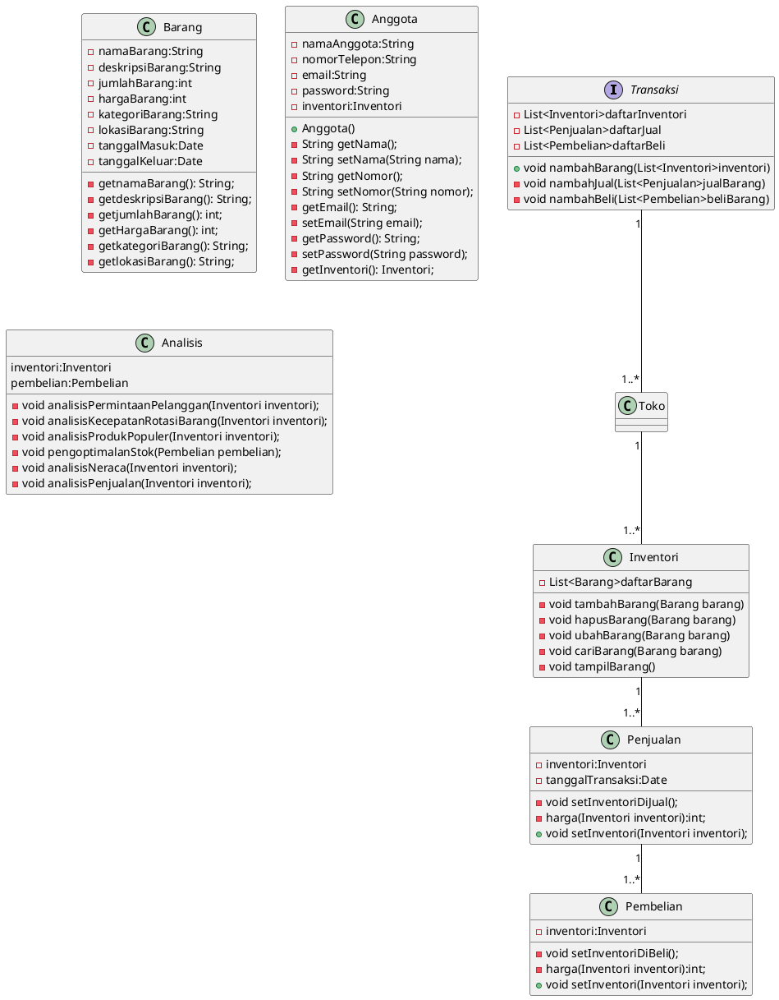

# Kasus 3: Aplikasi Manajemen Inventori

Aplikasi manajemen inventori adalah sebuah sistem yang dirancang untuk membantu bisnis dalam melacak, mengelola, dan mengoptimalkan stok atau persediaan barang mereka. Proses bisnis aplikasi manajemen inventori meliputi beberapa tahapan seperti berikut:

1. Pengumpulan Data Inventori: Tahap awal dari proses bisnis aplikasi manajemen inventori adalah pengumpulan data inventori. Hal ini meliputi pengumpulan informasi tentang semua barang yang dimiliki oleh bisnis, mulai dari nama barang, deskripsi, jumlah, hingga lokasi penyimpanan barang tersebut.

2. Pembaruan Data Inventori: Setelah data inventori dikumpulkan, selanjutnya adalah pembaruan data inventori secara berkala. Hal ini dilakukan untuk memastikan data inventori selalu up-to-date dan akurat. Pengguna aplikasi manajemen inventori juga dapat mengubah data inventori seperti menambah atau mengurangi jumlah barang yang tersedia.

3. Pencatatan Transaksi Inventori: Setiap transaksi yang terjadi pada barang harus dicatat secara akurat pada aplikasi manajemen inventori. Transaksi tersebut meliputi pembelian barang, penjualan barang, atau transfer barang dari satu lokasi ke lokasi lain.

4. Analisis Data Inventori: Aplikasi manajemen inventori juga dapat membantu bisnis dalam menganalisis data inventori mereka. Analisis data inventori ini bisa memberikan wawasan tentang permintaan pelanggan, kecepatan rotasi barang, serta produk apa yang paling populer di pasaran.

5. Pengoptimalan Stok: Setelah data inventori dianalisis, pengguna aplikasi manajemen inventori dapat mengoptimalkan stok barang mereka. Hal ini dilakukan dengan cara menyesuaikan jumlah barang yang tersedia sesuai dengan permintaan pasar, dan memastikan stok barang selalu tersedia pada waktu yang tepat.

6. Pelaporan: Aplikasi manajemen inventori juga dapat menghasilkan laporan tentang stok barang yang dimiliki bisnis. Laporan ini dapat memberikan informasi tentang kinerja inventori bisnis, termasuk laporan keuangan seperti laba rugi dan neraca.

Dengan menggunakan aplikasi manajemen inventori, bisnis dapat meningkatkan efisiensi operasional dan meningkatkan profitabilitas. Dalam proses bisnis aplikasi manajemen inventori, pengguna aplikasi harus memastikan data inventori selalu terjaga keakuratannya dan selalu diperbarui secara berkala.

