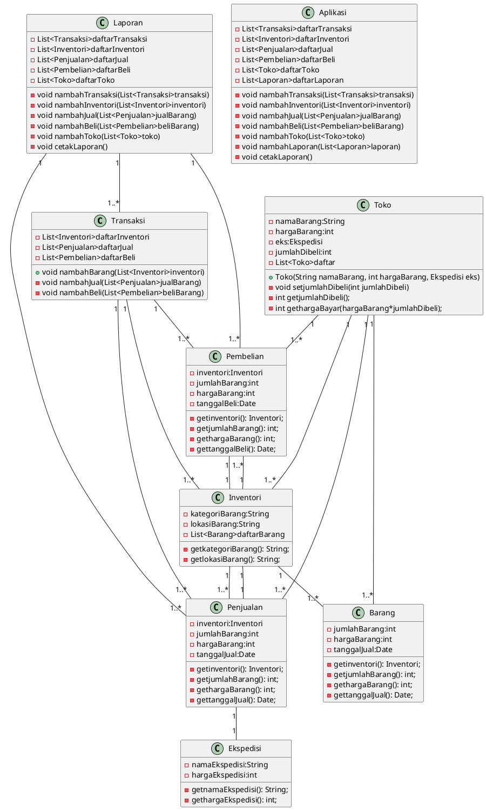

# Plantuml dari Zoho Inventory

```plantuml
@startuml

class Transaksi {
  - List<Inventori>daftarInventori
  - List<Penjualan>daftarJual
  - List<Pembelian>daftarBeli

  + void nambahBarang(List<Inventori>inventori)
  - void nambahJual(List<Penjualan>jualBarang)
  - void nambahBeli(List<Pembelian>beliBarang)
}

class Toko {
  - namaBarang:String
  - hargaBarang:int
  - eks:Ekspedisi
  - jumlahDibeli:int
  - List<Toko>daftar

  + Toko(String namaBarang, int hargaBarang, Ekspedisi eks)
  - void setjumlahDibeli(int jumlahDibeli)
  - int getjumlahDibeli();
  - int gethargaBayar(hargaBarang*jumlahDibeli);
}

class Barang {

- jumlahBarang:int
- hargaBarang:int
- tanggalJual:Date

- getinventori(): Inventori;
- getjumlahBarang(): int;
- gethargaBarang(): int;
- gettanggalJual(): Date;

 }

 class Pembelian {

- inventori:Inventori
- jumlahBarang:int
- hargaBarang:int
- tanggalBeli:Date

- getinventori(): Inventori;
- getjumlahBarang(): int;
- gethargaBarang(): int;
- gettanggalBeli(): Date;
 }

 class Ekspedisi {

- namaEkspedisi:String
- hargaEkspedisi:int

- getnamaEkspedisi(): String;
- gethargaEkspedisi(): int;
 }

 class Laporan {

- List<Transaksi>daftarTransaksi
- List<Inventori>daftarInventori
- List<Penjualan>daftarJual
- List<Pembelian>daftarBeli
- List<Toko>daftarToko

- void nambahTransaksi(List<Transaksi>transaksi)
- void nambahInventori(List<Inventori>inventori)
- void nambahJual(List<Penjualan>jualBarang)
- void nambahBeli(List<Pembelian>beliBarang)
- void nambahToko(List<Toko>toko)
- void cetakLaporan()
 }

class Inventori {
  - kategoriBarang:String
  - lokasiBarang:String
  - List<Barang>daftarBarang

  - getkategoriBarang(): String;
  - getlokasiBarang(): String;
}

class Penjualan {
  - inventori:Inventori
  - jumlahBarang:int
  - hargaBarang:int
  - tanggalJual:Date

  - getinventori(): Inventori;
  - getjumlahBarang(): int;
  - gethargaBarang(): int;
  - gettanggalJual(): Date;
}

class Aplikasi {

- List<Transaksi>daftarTransaksi
- List<Inventori>daftarInventori
- List<Penjualan>daftarJual
- List<Pembelian>daftarBeli
- List<Toko>daftarToko
- List<Laporan>daftarLaporan

- void nambahTransaksi(List<Transaksi>transaksi)
- void nambahInventori(List<Inventori>inventori)
- void nambahJual(List<Penjualan>jualBarang)
- void nambahBeli(List<Pembelian>beliBarang)
- void nambahToko(List<Toko>toko)
- void nambahLaporan(List<Laporan>laporan)
- void cetakLaporan()
 }

 Toko "1" -- "1..*" Barang
 Toko "1" -- "1..*" Inventori
 Toko "1" -- "1..*" Penjualan
 Toko "1" -- "1..*" Pembelian

 Inventori "1" -- "1..*" Barang
 Inventori "1" -- "1..*" Penjualan
 Inventori "1" -- "1..*" Pembelian

 Penjualan "1" -- "1" Inventori
 Penjualan "1" -- "1" Ekspedisi

 Pembelian "1" -- "1" Inventori

 Transaksi "1" -- "1..*" Penjualan
 Transaksi "1" -- "1..*" Pembelian
 Transaksi "1" -- "1..*" Inventori

 Laporan "1" -- "1..*" Transaksi
 Laporan "1" -- "1..*" Penjualan
 Laporan "1" -- "1..*" Pembelian

@enduml
```
