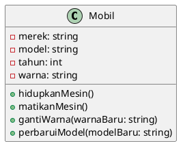
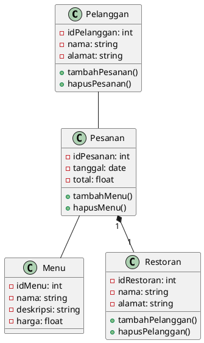
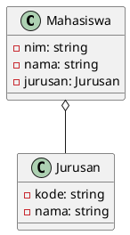
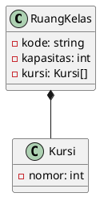
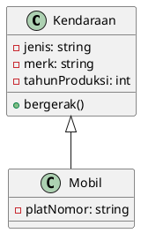
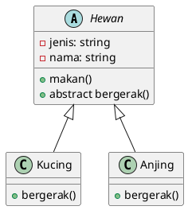
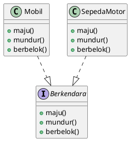

# UML (Unified Modeling Language)
UML (Unified Modeling Language) adalah bahasa visual yang digunakan untuk menggambarkan, merancang, dan memodelkan sistem yang kompleks seperti perangkat lunak atau sistem informasi bisnis. UML digunakan untuk memudahkan komunikasi antara pemangku kepentingan dalam proyek dan membantu memahami persyaratan, desain, dan arsitektur sistem.

UML terdiri dari sejumlah diagram, termasuk diagram kelas, diagram aktivitas, diagram use case, dan banyak lagi. Setiap diagram UML memiliki tujuan yang berbeda dan memberikan pandangan yang berbeda terhadap sistem yang dijelaskan.

Contoh UML
Berikut adalah contoh UML untuk kelas "Mobil":

Gambar di atas menunjukkan bahwa kelas "Mobil" memiliki empat atribut (merek, model, tahun, dan warna) dan empat metode (hidupkanMesin, matikanMesin, gantiWarna, dan perbaruiModel). Dalam hal ini, UML membantu dalam memahami struktur kelas dan bagaimana kelas tersebut dapat digunakan dalam sistem yang lebih besar.

## Diagram Kelas (Class Diagram)
Diagram kelas (class diagram) adalah salah satu jenis diagram UML yang digunakan untuk menggambarkan struktur statis dari sistem. Diagram kelas digunakan untuk menggambarkan kelas-kelas dalam sistem, atribut dan metode yang dimiliki oleh setiap kelas, serta hubungan antar kelas.

Diagram kelas digunakan oleh pengembang perangkat lunak untuk memvisualisasikan struktur perangkat lunak dan untuk memudahkan komunikasi antara tim pengembang dan pengguna sistem.

Contoh Diagram Kelas
Berikut adalah contoh diagram kelas untuk sistem manajemen restoran:

Pada diagram kelas di atas, kita menggambarkan empat kelas utama dalam sistem manajemen restoran: Pelanggan, Menu, Pesanan, dan Restoran. Setiap kelas memiliki atribut dan metode yang berbeda, dan hubungan antara kelas digambarkan dengan menggunakan panah dan tanda *.

Hubungan antara Pelanggan dan Pesanan digambarkan dengan panah dari Pelanggan ke Pesanan, yang menunjukkan bahwa satu Pelanggan dapat memiliki banyak Pesanan. Hubungan antara Pesanan dan Menu digambarkan dengan panah dari Pesanan ke Menu, yang menunjukkan bahwa satu Pesanan dapat memiliki banyak Menu. Hubungan antara Pesanan dan Restoran digambarkan dengan tanda *, yang menunjukkan bahwa satu Restoran dapat memiliki banyak Pesanan dan setiap Pesanan terkait dengan satu Restoran.

Diagram kelas membantu kita memahami struktur sistem secara lebih rinci dan membantu pengembang perangkat lunak dalam merancang dan membangun sistem yang kompleks.

## Hubungan Antar Kelas dalam Diagram Kelas
Terdapat beberapa jenis hubungan antar kelas dalam diagram kelas, di antaranya adalah:

### Aggregation
Aggregation menggambarkan hubungan antara kelas yang saling terkait di mana sebuah objek yang menjadi bagian dari objek lain dapat menjadi bagian dari beberapa objek lain pada saat yang sama.

Contoh: Hubungan antara kelas "Mahasiswa" dan "Jurusan". Satu jurusan dapat memiliki banyak mahasiswa, dan satu mahasiswa hanya terdaftar pada satu jurusan.

### Composition
Composition menggambarkan hubungan antara kelas yang saling terkait di mana sebuah objek yang menjadi bagian dari objek lain tidak dapat menjadi bagian dari objek lain pada saat yang sama.

Contoh: Hubungan antara kelas "Ruang Kelas" dan "Kursi". Satu ruang kelas memiliki banyak kursi, tetapi satu kursi hanya terdapat pada satu ruang kelas.

### Inheritance
Inheritance menggambarkan hubungan antara kelas induk (parent class) dan kelas anak (child class) di mana kelas anak mewarisi atribut dan metode dari kelas induk.

Contoh: Hubungan antara kelas "Kendaraan" dan "Mobil". Kelas "Mobil" mewarisi atribut dan metode dari kelas "Kendaraan".

Hubungan antar kelas dalam diagram kelas sangat penting untuk memahami struktur sistem secara lebih rinci dan membantu pengembang perangkat lunak dalam merancang dan membangun sistem yang kompleks. Aggregation, composition, dan inheritance adalah tiga jenis hubungan antar kelas yang umum digunakan dalam diagram kelas.

### Abstract Class
Abstract class adalah kelas yang tidak dapat diinstansiasi dan biasanya digunakan sebagai kerangka dasar (template) untuk kelas turunan (subclass) yang lebih spesifik. Abstract class dapat berisi metode abstrak (abstract method) yang harus diimplementasikan oleh kelas turunan.

Penggambaran UML dari abstract class menggunakan notasi yang sama dengan kelas biasa, tetapi dengan penambahan huruf miring pada nama kelas dan metode abstrak ditandai dengan garis miring di bawah nama metode.

Contoh: Abstract class "Hewan" dengan metode abstrak "bergerak()" yang harus diimplementasikan oleh kelas turunan seperti "Kucing" dan "Anjing".

### Interface
Interface adalah kelas abstrak yang sepenuhnya terdiri dari metode abstrak dan konstanta. Interface digunakan untuk menentukan kontrak antara kelas dan kelas lain atau antara objek dan objek lain. Setiap kelas yang mengimplementasikan sebuah interface harus menyediakan implementasi untuk semua metode yang terdapat pada interface tersebut.

Penggambaran UML dari interface menggunakan notasi kelas yang sama dengan kelas biasa, tetapi dengan penambahan tanda garis-garis putus-putus di bawah nama interface.

Contoh: Interface "Berkendara" dengan metode "maju()", "mundur()", dan "berbelok()" yang harus diimplementasikan oleh kelas-kelas yang mengimplementasikan interface tersebut seperti "Mobil" dan "Sepeda Motor".

Abstract class dan interface adalah konsep penting dalam pemrograman berorientasi objek. Abstract class digunakan untuk memfasilitasi pembuatan kelas turunan dan interface digunakan untuk menentukan kontrak antara kelas dan kelas lain. Dalam UML, abstract class dan interface memiliki notasi yang berbeda dibandingkan dengan kelas biasa.