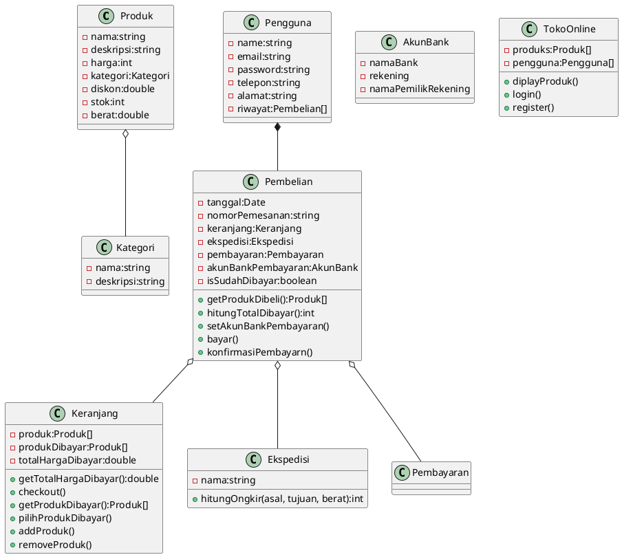

# Aplikasi Toko Online

## Kasus
Anda diminta untuk membuat aplikasi toko online yang menjual produk komputer dan laptop serta aksesorisnya termasuk produk-produk digital seperti software (OS atau aplikasi). Aplikasi ini harus memiliki fitur-fitur berikut.

1. Toko online dapat menampilkan produk-produk yang dijual. Produk ditampilkan berdasarkan kategori.
2. Setiap produk memiliki atribut seperti nama, harga, deskripsi, kategori, diskon, dan stok.
3. Pengguna dapat melihat produk-produk yang dijual dan melakukan pencarian produk berdasarkan nama produk atau kategori produk.
5. Pengguna dapat memasukkan produk yang dicarinya ke dalam keranjang belanja dan melakukan checkout.
6. Jika pengguna ingin checkout, maka harus login terlebih dahulu dan jika belum terdaftar, maka harus mendaftar terlebih dahulu.
7. Setelah checkout, pengguna melakukan pembayaran sesuai total yang harus dibayar termasuk ongkos kirim.
8. Pembayaran dilakukan melalui transfer bank dan pembeli harus mengkonfirmasi pembayarannya.
9. Setiap pengguna memiliki atribut seperti nama, alamat email, nomor telepon, alamat rumah, dan riwayat transaksi pembelian.

## Soal
1. Lakukan identifikasi kelas-kelas yang dapat dibuat dari kasus di atas termasuk interface maupun abstract class jika diperlukan.
2. Buatlah kelas diagram yang menggambarkan hubungan antar kelas.
3. Buatlah implementasi program menggunakan Java.

## Jawaban

### Identifikasi Kelas
1. Produk
2. Pengguna
3. Keranjang
5. Akun Bank
6. Ekspedisi
7. Kategori
8. Pembelian

### Kelas Diagram
